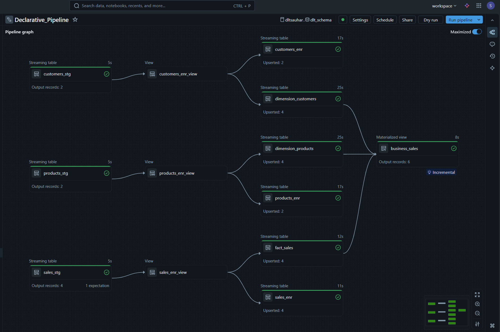

# Databricks Declarative Pipeline

A production-ready data pipeline implementation using Databricks Delta Live Tables (DLT) for declarative ETL/ELT workflows.

## 📋 Overview

This project demonstrates a declarative approach to building data pipelines in Databricks using Delta Live Tables. It implements CDC (Change Data Capture), SCD Type 2 (Slowly Changing Dimensions), and data quality checks in a maintainable, code-first manner.

## 🏗️ Architecture



The pipeline follows a medallion architecture pattern:
- **Bronze Layer**: Raw data ingestion
- **Silver Layer**: Cleaned and transformed data
- **Gold Layer**: Business-ready aggregated datasets

## 📂 Project Structure
```
Databricks-Declarative-Pipeline/
├── data_source.sql              # Source data definitions and schemas
├── transformations_sourcecode/  # DLT transformation logic
├── utilities/                   # Helper functions and configurations
├── explorations/               # Exploratory notebooks and analysis
├── pipeline_graph.png          # Visual pipeline architecture
└── business_sales.png          # Business metrics visualization
```

## 🚀 Features

- **Declarative Pipeline Definition**: Uses Delta Live Tables for simplified pipeline creation
- **Auto CDC Flow**: Automatic change data capture with `create_auto_cdc_flow`
- **SCD Type 2**: Tracks historical changes in dimension tables
- **Data Quality Checks**: Built-in expectations and constraints
- **Incremental Processing**: Efficient streaming table updates

## 🛠️ Technologies

- **Databricks**: Unified analytics platform
- **Delta Live Tables (DLT)**: Declarative ETL framework
- **PySpark**: Data processing engine
- **Delta Lake**: Storage layer with ACID transactions


## Traditional Method

```python
df = spark.read.parquet("data")
df = df.filter("id IS NOT NULL")
df = df.dropDuplicates(["id"])
df.write.saveAsTable("customers")
```

## Databricks Delta Live Tables (DLT) – Declarative Pipeline
```python
import dlt
@dlt.table
@dlt.expect_or_drop("valid_id", "id IS NOT NULL")
def customers():
    return spark.read.parquet("data").dropDuplicates(["id"])
```

## 📦 Getting Started

### Prerequisites

- Databricks workspace
- Appropriate cluster configuration for DLT pipelines
- Access to source data systems

### Installation

1. Clone the repository:
```bash
git clone https://github.com/sauhar/Databricks-Declarative-Pipeline.git
cd Databricks-Declarative-Pipeline
```

2. Import notebooks into your Databricks workspace

3. Configure your data sources in `data_source.sql`


### Running the Pipeline

1. Create a DLT pipeline in Databricks UI
2. Point to the transformation notebooks in `transformations_sourcecode/`
3. Configure target schema and storage location
4. Run the pipeline (triggered or continuous mode)

## 📊 Pipeline Components

### Data Sources
- Defined in `data_source.sql`
- Supports multiple source systems

### Transformations
Located in `transformations_sourcecode/`:
- Bronze to Silver transformations
- Silver to Gold aggregations
- Dimension table management with SCD Type 2


## 🔍 Example: CDC Flow with SCD Type 2
```python
import dlt

dlt.create_auto_cdc_flow(
    target="dimension_products",
    source="products_source_view",
    keys=["product_id"],
    sequence_by="last_updated",
    stored_as_scd_type=2
)
```
